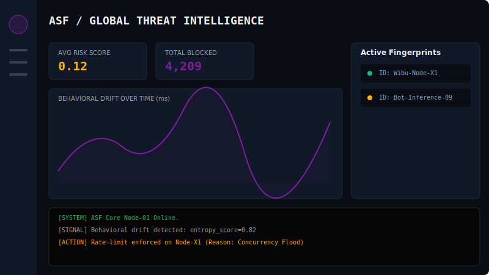
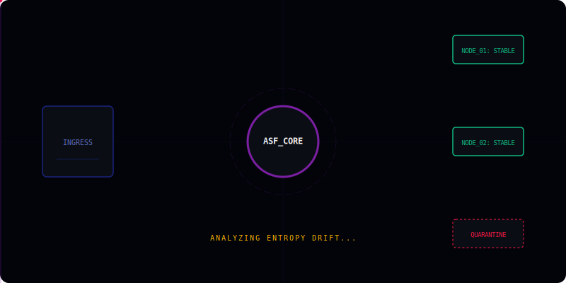

# Adaptive Shield Firewall (ASF) — Autonomous Behavioral Cyber Defense Gateway

**Adaptive Shield Firewall (ASF)** is an **enterprise-grade behavioral security gateway** engineered for modern distributed systems, microservices architectures, and API-first infrastructures operating at high scale. ASF is built on a **Zero-Trust security paradigm** combined with **adaptive threat intelligence engineering**, replacing traditional static rule-based firewall mechanisms with **probabilistic behavioral inference**, **entropy-driven identity modeling**, and **real-time dynamic risk scoring systems**.

ASF treats all incoming traffic as a **continuous temporal behavioral stream**, where each request is not an isolated transaction but a contributing vector within a continuously evolving behavioral state model. This enables detection of advanced adversarial patterns including API abuse, credential stuffing, replay-based exploitation, bot orchestration, concurrency flooding, and distributed multi-vector attack campaigns at early-stage behavioral deviation thresholds.

Unlike conventional Web Application Firewalls (WAFs), which rely on deterministic signature matching and static rule sets, ASF implements a **self-adaptive security orchestration pipeline** capable of dynamically recalibrating detection thresholds based on behavioral drift, system topology evolution, and emergent threat intelligence signals.

---

# Enterprise Security Model

ASF is founded on a **behavior-centric security architecture**, where identity validation is derived from probabilistic behavioral coherence rather than static credentials or deterministic identifiers. The system evaluates whether a request conforms to expected behavioral distributions under a continuously updated baseline model.

The architecture is structured around four core security primitives: **behavioral authenticity verification**, **distributed threat correlation**, **concurrency integrity enforcement**, and **autonomous adaptive risk governance**. This allows ASF to defend against both known attack signatures and unknown zero-day behavioral anomalies through statistical inference and deviation analysis.

---

# Core Security Paradigm

ASF implements a hybrid deterministic–probabilistic evaluation model where every request is mapped into a **high-dimensional behavioral identity graph**. Instead of evaluating whether a request matches a known malicious pattern, ASF evaluates whether the request exhibits statistically valid behavioral consistency within an expected probabilistic manifold.

This paradigm enables detection of sophisticated adversarial techniques, including automated bot frameworks, adaptive scraping systems, distributed credential stuffing networks, session hijacking attempts, replay-based exploitation chains, API abuse orchestration, and high-frequency concurrency manipulation attacks.

---

# Adaptive Risk Scoring Engine

At the core of ASF lies an **adaptive probabilistic risk scoring engine** that transforms multidimensional behavioral signals into a unified security decision metric.

Risk evaluation is defined as:

RiskScore = (BotBehaviorCoefficient × 0.2) + (TrafficAnomalyIndex × 0.3) + (ConcurrencyConflictProbability × 0.3) + (BehavioralDeviationScore × 0.2)

This model enables continuous recalibration of system sensitivity based on real-time traffic dynamics, ensuring that enforcement policies remain adaptive rather than static. RiskScore is mapped into dynamic enforcement tiers ranging from passive monitoring to immediate threat mitigation.

---

# System Architecture

ASF is designed as a **layered distributed security processing pipeline** optimized for low-latency and high-throughput environments. The processing flow is structured as follows: Client Layer → Edge Gateway (WAF + Rate Limiter) → ASF Core Processing Engine → Behavioral Fingerprint Subsystem → Threat Intelligence Layer → AI-Based Risk Scoring Engine → Concurrency Integrity Controller → Authorization Enforcement Layer → Application Microservices → Persistent Data Layer (PostgreSQL + Redis Cluster).

---

# Behavioral Fingerprint Engine

The Behavioral Fingerprint Engine constructs a **multi-dimensional probabilistic identity model** for each interacting entity. Unlike traditional fingerprinting systems that rely on static identifiers such as IP address or User-Agent strings, ASF generates dynamic behavioral signatures using entropy-based analysis across multiple vectors.

These vectors include HTTP header entropy distribution, TLS handshake fingerprint profiling, user-agent structural decomposition, temporal request variance modeling, session continuity correlation, device behavioral consistency mapping, and API interaction rhythm analysis. The resulting identity model is continuously recalibrated against historical baselines to detect impersonation, automation frameworks, and behavioral spoofing attempts.

---

# AI Threat Intelligence Layer

ASF incorporates an advanced **anomaly intelligence subsystem** designed to identify previously unseen attack patterns through statistical deviation modeling and behavioral inference techniques.

Key analytical modules include adaptive anomaly detection engines, bot classification based on behavioral inconsistency metrics, sequential request correlation analysis, entropy variance quantification, temporal drift detection, and predictive threat escalation modeling. This layer enables ASF to transition from reactive defense mechanisms to predictive security posture adaptation.

---

# Concurrency Integrity Protection Layer

ASF integrates a dedicated **distributed concurrency control subsystem** designed to mitigate race-condition vulnerabilities and transactional inconsistencies in high-frequency systems.

This module enforces system-wide integrity using Redis-based distributed locking mechanisms, atomic transaction orchestration, temporal consistency validation, request serialization strategies, and collision probability mitigation algorithms. It is particularly critical in financial systems, payment gateways, inventory reservation engines, and real-time transactional infrastructures where concurrency anomalies can lead to state corruption or financial inconsistency.

---

# Observability and Telemetry Infrastructure

ASF provides a comprehensive **real-time security observability framework** designed for continuous monitoring of system behavior, threat evolution, and infrastructure health.

The telemetry layer supports live risk score visualization, behavioral drift tracking, concurrency anomaly monitoring, distributed node performance analytics, and aggregated threat intelligence streaming. It is fully compatible with OpenTelemetry standards and integrates with Prometheus, Grafana, ELK stack, and enterprise SIEM platforms for centralized security operations.

---

# Cloud-Native Deployment Architecture

ASF is engineered for **cloud-native and hybrid-cloud environments**, featuring stateless processing units, containerized deployment models, Kubernetes orchestration compatibility, horizontal auto-scaling mechanisms, distributed caching layers, and edge-deployable gateway nodes.

This architecture ensures operational resilience across multi-cloud infrastructures, bare-metal deployments, and edge computing environments while maintaining consistent security enforcement policies.

---

# Technology Stack

Core Backend: TypeScript, Node.js, NestJS  
Security Infrastructure: NGINX reverse proxy, Helmet security middleware, Redis distributed locking, JWT authentication framework, adaptive security middleware layer  
Data Infrastructure: PostgreSQL, Redis Cluster, distributed caching systems  
Observability Stack: OpenTelemetry, Prometheus, Grafana, ELK logging pipeline, structured audit trail systems  
Deployment Infrastructure: Docker, Docker Compose, Kubernetes-ready orchestration layer  
Intelligence Layer: statistical anomaly detection models, entropy-based classification engines, behavioral risk scoring systems, adaptive threshold calibration algorithms  

---

# Security Processing Pipeline

Incoming Request → Edge Filtering Layer → Rate Limiting Engine → Behavioral Fingerprint Construction → Entropy-Based Behavioral Analysis → AI Threat Classification Layer → Concurrency Integrity Validation → Dynamic Risk Scoring Engine → Policy Enforcement Layer → Secure Execution Runtime → Telemetry Logging Pipeline → Threat Intelligence Feedback Loop

---

# Enterprise Use Cases

ASF is optimized for mission-critical infrastructures requiring high assurance of behavioral authenticity and transactional integrity, including fintech platforms, banking APIs, SaaS authentication gateways, e-commerce payment systems, Web3 transaction relays, real-time analytics pipelines, and large-scale distributed microservice ecosystems.

---

# Future Roadmap

Planned advancements include integration of deep learning-based anomaly detection (Isolation Forest, LSTM-based temporal modeling), reinforcement learning-driven adaptive security policies, federated threat intelligence networks, geo-distributed edge security clusters, autonomous incident response systems, and globally synchronized threat mitigation frameworks.

---

# Repository and Deployment

Installation:

git clone https://github.com/ManucianTeam/Adaptive-Shield-Firewall-ASF-  
cd Adaptive-Shield-Firewall-ASF-  
npm install  

Environment Configuration:

PORT=  
REDIS_HOST=  
REDIS_PORT=  
DATABASE_URL=  
JWT_SECRET=  

Infrastructure Deployment:

docker-compose up -d  

Development Mode:

npm run start:dev  

---

# Visual Asset Placeholders

Enterprise-grade architecture visualization assets to be integrated:

01. Core Identity & Branding
The visual foundation of ASF represents the convergence of distributed security and adaptive intelligence. The minimalist shield geometry symbolizes robust protection, while the amber-violet core reflects the dynamic risk-scoring engine at the heart of the system:

ＩＤΞＮＴＩＴＹ ＰＲＩＭＩＴＩＶΞ — A vector-precision emblem featuring a central AI core and distributed node accents, engineered with a dark minimal aesthetic to represent the ManucianTeam defensive paradigm.

Real-Time Security Observability
The ASF Dashboard provides a high-fidelity interface for monitoring system health and threat evolution. It transforms multidimensional telemetry into actionable intelligence, allowing architects to visualize the "pulse" of the entire infrastructure.

Observability Module — A high-fidelity interface featuring a Behavioral Drift Chart, Entropy Variance Heatmap, and a Live Telemetry Stream for real-time risk scoring and distributed node status monitoring.

Neural-Behavioral Processing Pipeline
This advanced schematic visualizes the autonomous decision-making journey of a request. It maps the transition from raw traffic to verified identity, illustrating how the system enforces security without compromising throughput.

◈ Phase A: Architectural Intelligence & Risk Assessment — The Ingress Layer captures raw traffic for entropy analysis before routing it to the ASF Core, where probabilistic algorithms calculate real-time risk scores based on behavioral drift.

◈ Phase B: Autonomous Traffic Orchestration & Mitigation — Verified requests are visualized as amber particles orchestrated toward stable Distributed Nodes, while anomalous threats are forcibly redirected into a Quarantine zone for isolation.

---

# License and Research Scope

ASF is released as a **cybersecurity research and defensive engineering framework**, intended exclusively for educational, experimental, and enterprise defensive architecture applications. The system is designed to advance research in behavioral cybersecurity, distributed threat intelligence, and adaptive security engineering.

Any offensive, malicious, or unauthorized exploitation of this framework is strictly outside its intended scope.

---

# Professional Credits

Developed by: **ManucianTeam**  
Lead System Architect & Security Research: **manucian-official (L2K)**  

Project Classification: Enterprise Behavioral Cyber Defense Framework  
Core Domains: Adaptive cybersecurity engineering, behavioral anomaly detection, distributed security systems, AI-assisted threat intelligence, concurrency integrity protection, and zero-trust architecture design.

Acknowledgment: This framework is conceptually aligned with modern Zero-Trust principles, OWASP security methodologies, distributed systems theory, and contemporary research in AI-driven cybersecurity defense systems.
